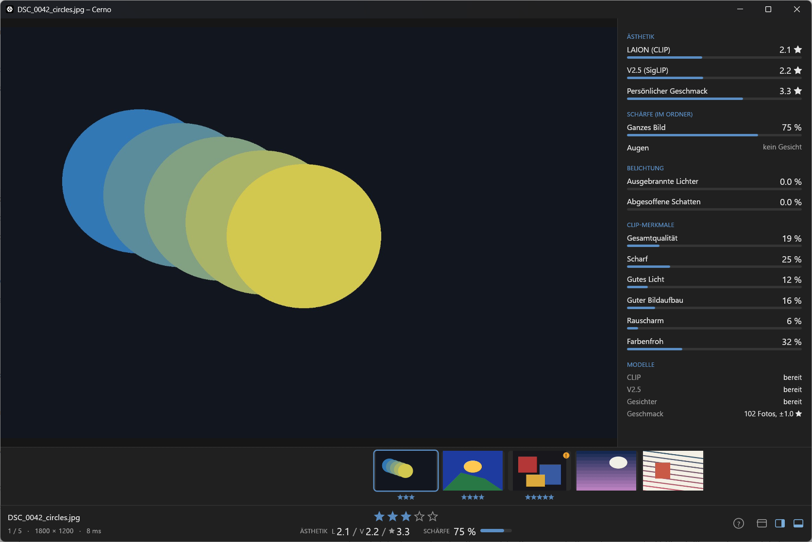
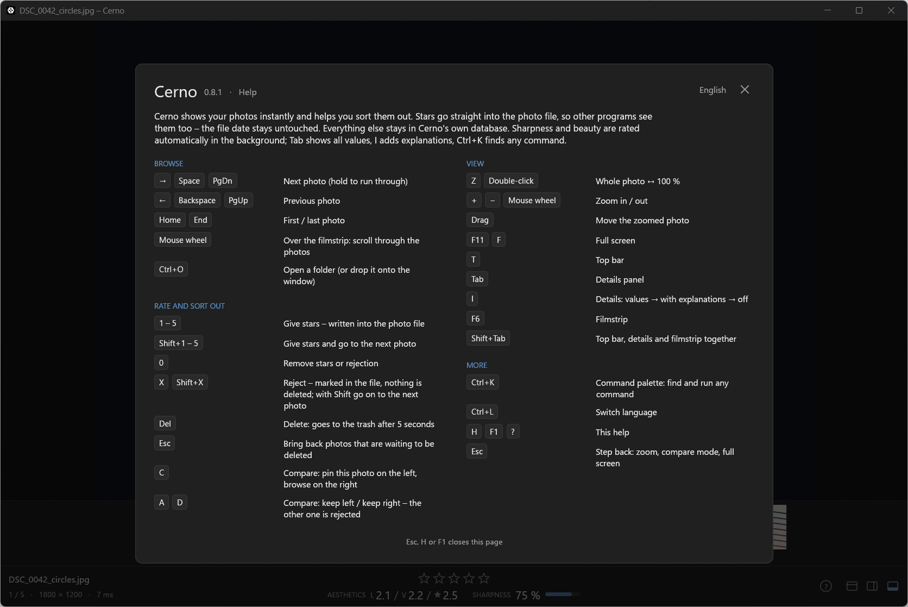

# Cerno

**Fast photo viewer and culling tool – instant switching, keyboard ratings, local sharpness and aesthetics scores, file dates untouched.**

[](./LICENSE)
[](https://github.com/fly2nbc-oss/Cerno/actions/workflows/ci.yml)
[](#supported-platforms--formats)

Cerno (Latin *cerno* – "I sift, discern, see clearly") is a native Rust desktop app built on **egui + wgpu**. Neighbours of the current photo are decoded in the background and kept as GPU textures, so switching feels instant. Ratings go straight into the file as `xmp:Rating`, which Lightroom, Bridge, digiKam and Windows Explorer read – without changing modification or creation dates. Sharpness and aesthetics run locally (DirectML on Windows) and live in Cerno's database, never in your photos.

---

## Table of Contents

- [Screenshots](#screenshots)
- [Features](#features)
- [Quick Start](#quick-start)
- [Usage](#usage)
- [Scores](#scores)
- [Supported Platforms & Formats](#supported-platforms--formats)
- [Development & Build](#development--build)
- [Project Structure](#project-structure)
- [Tech Stack](#tech-stack)
- [Roadmap & Known Issues](#roadmap--known-issues)
- [Contributing](#contributing)
- [License](#license)

---

## Screenshots

<p align="center">
  
</p>

<p align="center">
  
</p>

---

## Features

- **Instant switching** – prefetch at monitor resolution as GPU textures.
- **Keyboard ratings** – `1`–`5` stars, `X` reject (`xmp:Rating = -1`), dates preserved; `Ctrl+K` command palette.
- **Zoom & compare** – 100 % zoom with tiles; `C` pins a photo, `A`/`D` reject the other.
- **Delete with undo** – `Delete` → trash after 5 s; `Esc` restores the queue.
- **Filmstrip & info bar** – stars, blurry marker, aesthetics `L / V / ★`, sharpness, capture data, GPS map pin.
- **Local scores** – sharpness, LAION / V2.5 aesthetics, personal taste, exposure, CLIP attributes; sort and filter in the toolbar.
- **Five languages** – DE / EN / FR / ES / IT (`Ctrl+L`); help via `H` / `F1` / `?`.

---

## Quick Start

No binary releases yet – build from source:

```bash
cargo run --release --features heic -- "D:/Photos/2026-09 Trip"
```

Or drop a folder onto the window / `Ctrl+O`. Copy `DirectML.dll` next to `cerno.exe` when moving the binary.

**Ratings:** [ExifTool](https://exiftool.org/) on `PATH` (`winget install OliverBetz.ExifTool` / `apt install libimage-exiftool-perl`). Viewing works without it. `CERNO_EXIFTOOL` overrides the path.

---

## Usage

| Input | Action |
|---|---|
| `→` `Space` / `←` `Backspace` | Next / previous |
| `1`–`5` / `0` | Rate / clear |
| `Shift+1`–`5` | Rate and advance |
| `X` / `Shift+X` | Reject / reject and advance |
| `Delete` / `Esc` | Trash countdown / undo deletions |
| `C` then `A` / `D` | Compare: keep left / right |
| `Z` / wheel / drag | Zoom 100 % / zoom / pan |
| `Tab` / `I` / `F6` / `T` | Details / explanations / filmstrip / top bar |
| `Shift+Tab` | Toggle top bar, details and filmstrip |
| `Ctrl+K` / `Ctrl+L` / `Ctrl+O` | Palette / language / open folder |
| `H` `F1` `?` / `F11` | Help / fullscreen |

---

## Scores

Background analysis (nearest first) is stored in `%LOCALAPPDATA%\Cerno\data\cerno.db` (Linux: `~/.local/share/cerno/cerno.db`); models under `…/models`. Scores never set your stars.

- **Sharpness** – Laplacian on the sharpest tiles; folder percentile; optional eye sharpness via built-in [YuNet](https://github.com/opencv/opencv_zoo/tree/main/models/face_detection_yunet).
- **Aesthetics** – LAION (CLIP, download from the toolbar, ~1.2 GB) and optional V2.5 (SigLIP files in the models folder; AGPL head not bundled). Shown as stars 0–5 (`L … / V … / ★ …`).
- **Personal taste** – ridge regression on your ratings and deletions (from 15 examples).
- **Exposure & CLIP attributes** – blown/crushed pixels; zero-shot quality cues 0–100 %.

---

## Supported Platforms & Formats

| | Windows | Linux |
|---|---|---|
| Rendering | wgpu (DX12 / Vulkan) | wgpu (Vulkan), X11 / Wayland |
| JPEG | ✓ | ✓ |
| HEIC | `--features heic` (vcpkg libheif) | `--features heic` (libheif ≥ 1.17) |
| Aesthetics GPU | DirectML, CPU fallback | CPU; experimental `--features webgpu` |

---

## Development & Build

Rust stable + C/C++ toolchain. First build downloads ONNX Runtime.

```bash
git clone https://github.com/fly2nbc-oss/Cerno.git
cd Cerno
cargo run -- <folder>
cargo build --release --features heic
cargo fmt --all -- --check
cargo clippy --all-targets -- -D warnings
cargo clippy --all-targets --features heic -- -D warnings
cargo test
cargo test --features heic
```

**HEIC (Windows)** – vcpkg bootstrap may need a manual finish:

```bash
cargo install cargo-vcpkg && cargo vcpkg build
target\vcpkg\bootstrap-vcpkg.bat -disableMetrics
target\vcpkg\vcpkg.exe install "libheif[core]:x64-windows-static-md"
```

**HEIC (Linux):** `sudo apt install libheif-dev`

---

## Project Structure

```
Cerno/
├── src/           # app, loader, decode, analysis, ui, i18n
├── tools/         # model prep scripts
├── tests/fixtures/
├── screenshots/
├── .github/workflows/ci.yml
├── Cargo.toml
├── CHANGELOG.md
├── CONTRIBUTING.md
├── CODE_OF_CONDUCT.md
├── THIRD_PARTY.md
└── README.md
```

---

## Tech Stack

egui/eframe + wgpu · zune-jpeg / optional libheif · ONNX Runtime (DirectML) · SQLite · ExifTool for ratings

---

## Roadmap & Known Issues

1. V2.5 model download button · 2. Linux verification · 3. Installers and updater

- No colour management (ICC ignored).
- Size+date sync tools may miss rating writes (`-P` keeps dates; XMP padding often keeps size).
- Truncated JPEGs show with grey missing parts; pending deletes run on exit unless cancelled.

---

## Contributing

See [`CONTRIBUTING.md`](./CONTRIBUTING.md) and [`CODE_OF_CONDUCT.md`](./CODE_OF_CONDUCT.md). Changelog: [`CHANGELOG.md`](./CHANGELOG.md).

---

## License

Licensed under the Apache License, Version 2.0. See [`LICENSE`](./LICENSE). Third-party components: [`THIRD_PARTY.md`](./THIRD_PARTY.md).

---

**Repository:** <https://github.com/fly2nbc-oss/Cerno>
