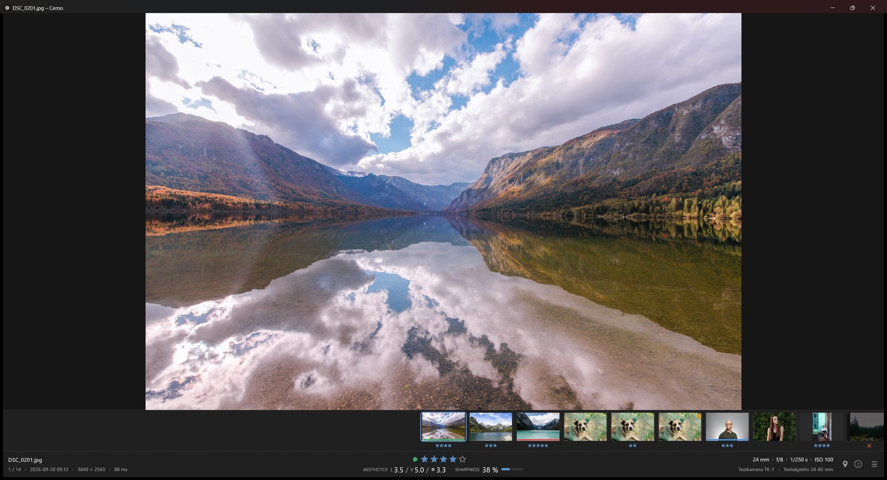
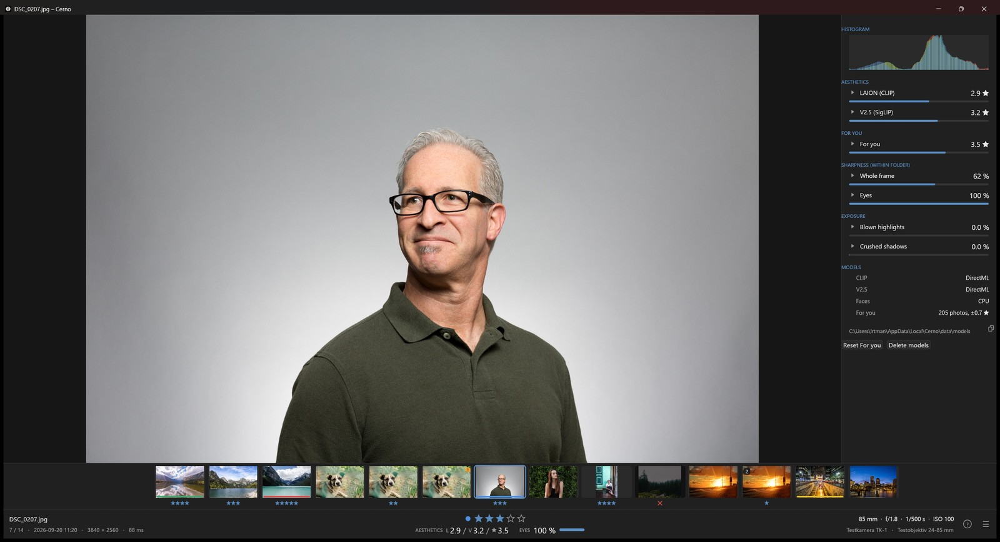
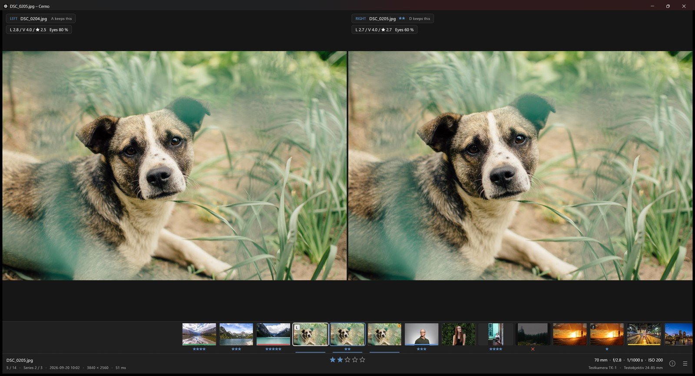
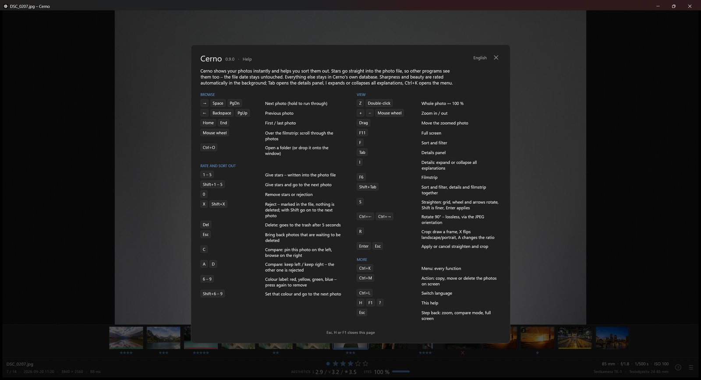

# Cerno

**Fast photo viewer and culling tool – instant switching, keyboard ratings, local sharpness and aesthetics scores, file dates untouched.**

[](./LICENSE)
[](https://github.com/fly2nbc-oss/Cerno/actions/workflows/ci.yml)
[](#supported-platforms--formats)

Cerno (Latin *cerno* – "I sift, discern, see clearly") is a native Rust desktop app built on **egui + wgpu**. Neighbours of the current photo are decoded in the background and kept as GPU textures, so switching feels instant. Ratings go straight into the file as `xmp:Rating`, which Lightroom, Bridge, digiKam and Windows Explorer read – without changing modification or creation dates. Sharpness and aesthetics run locally (DirectML on Windows) and live in Cerno's database, never in your photos.

---

## Table of Contents

- [Screenshots](#screenshots)
- [Features](#features)
- [Quick Start](#quick-start)
- [Usage](#usage)
- [Scores](#scores)
- [Supported Platforms & Formats](#supported-platforms--formats)
- [Development & Build](#development--build)
- [Project Structure](#project-structure)
- [Tech Stack](#tech-stack)
- [Roadmap & Known Issues](#roadmap--known-issues)
- [Contributing](#contributing)
- [License](#license)

---

## Screenshots

<p align="center">
  
</p>

<p align="center">
  
</p>

<p align="center">
  
</p>

<p align="center">
  
</p>

<sub>Sample photos: CC0 (public domain) Unsplash photos from Wikimedia Commons ([Images from Unsplash](https://commons.wikimedia.org/wiki/Category:Images_from_Unsplash)), by Ales Krivec, Héctor J. Rivas, Matheus Bandoch, Rodion Kutsaev, Foto Sushi, Christopher Campbell, Christian Gertenbach, Pacific Austin, Jeff Cooper, Nicolai Berntsen and Zoltan Kovacs. The camera data and the burst of three are made up for the screenshots.</sub>

---

## Features

- **Instant switching** – background workers prefetch the photos around the current one, decoded at monitor resolution and uploaded as GPU textures.
- **Keyboard-first, Lightroom-style keys** – `1`–`5` set stars, `Shift+1`–`5` rate and move on, `0` clears, `X` marks a photo as rejected (written as `xmp:Rating = -1`, nothing is deleted), `6`–`9` set a colour label (red, yellow, green, blue; purple is in the menu). `Ctrl+K` opens the menu at the bottom right – view, sort, filter, edit, photo, colour labels, language and help – with the shortcut shown on each row.
- **Safe metadata writes** – apart from the EXIF orientation of a 90° turn, the rating and the colour label (`xmp:Label`, English names) are the only metadata Cerno writes, in the background and debounced, in one pass when both change. File modification and creation dates stay bit-exact. Windows Explorer's own rating tags are kept in sync if present.
- **Straighten, crop, rotate (JPEG)** – `S` straightens over a fine grid (mouse wheel or arrows, `Shift` for finer steps), `R` crops to Original, 3:2, 4:3, 16:9 or 1:1 (`A` changes the ratio, `X` flips landscape/portrait), `Ctrl+←` / `Ctrl+→` rotate by 90° losslessly through the EXIF orientation. `Enter` applies, `Esc` cancels. Straighten and crop re-encode the JPEG (quality 95, no chroma subsampling) into the original file – there is no undo; the file dates stay as they were.
- **Zoom** – `Z` or double-click toggles 100 %, mouse wheel zooms around the cursor, drag pans. Full resolution is loaded on demand; zoom and position stay when you switch photos, so a series can be compared at the same spot.
- **Compare** – `C` pins the current photo on the left, the right side browses the rest. `A` keeps the left one, `D` the right one; the other is marked as rejected and the next photo moves in, so a burst is culled in a few keystrokes. Both sides zoom together. Aesthetics and sharpness sit under each photo. The menu's "Delete rejected photos" sends all rejects to the trash when you are done.
- **Series and duplicates** – photos shot within two seconds form a series; sorting by capture time puts the sharpest one first, and "Best of each series" hides the rest. Identical copies (same pixels) are marked as duplicates of the first file, never deleted on their own.
- **Folders** – open one folder, or turn on "Include subfolders" to read the tree under it (hidden folders stay out).
- **Delete without dialogs** – `Delete` hides the photo at once and moves it to the trash after a 5-second countdown; every further deletion restarts it, `Esc` brings all waiting photos back. Nothing blocks meanwhile.
- **Copy, move or delete what the filter shows** – the filter bar's Action menu (`Ctrl+M`) copies or moves every photo on screen to another folder, or deletes them, after one confirmation. Deleting uses the same countdown.
- **Filmstrip** – thumbnails with your stars, a colour stripe, a marker for probably blurry shots, and a wider gap between series.
- **Sharpness, aesthetics and For you** – see [Scores](#scores). Sort by name, capture time, rating, either aesthetics score, For you or sharpness. The filter bar (`F`) keeps sort and filter on one line and combines stars, unrated, rejected, blurry, duplicate copies and the five colour labels; nothing ticked shows every photo.
- **Details panel** – `Tab` shows every value Cerno measured for the current photo, `I` expands or collapses a short explanation in plain words under each value: both aesthetics scores, For you, whole-frame and eye sharpness, clipped highlights and shadows, CLIP attributes, a histogram and the state of each model. Rows fold open. For you can be reset from here, and the models section shows the folder of the model files with a button that copies the path.
- **Info bar** – always visible: stars, aesthetics and For you side by side (`L 6.1 / V 6.5 / ★ 2.4` = LAION / V2.5 / For you), sharpness, capture data incl. digital zoom, the current zoom level, and a map pin for photos with GPS coordinates (click opens Google Maps). A menu button at the bottom right (`Ctrl+K`) opens every function; by default only the photo, the filmstrip and the info bar are visible. The filter bar opens with `F`.
- **Five languages** – German, English, French, Spanish, Italian. Cerno starts in your system language; `Ctrl+L` switches, a flag briefly shows the new one.
- **Help** – `H`, `F1` or `?` lists all shortcuts with a short explanation; the start screen shows the same page.
- **Capture info** – camera, lens, focal length, aperture, shutter speed, ISO and capture date.
- **Correct orientation**, natural sort order (`IMG_2` before `IMG_10`, umlauts next to their base letter).

---

## Quick Start

No binary releases yet – build from source:

```bash
cargo run --release --features heic -- "D:/Photos/2026-09 Trip"
```

Or drop a folder onto the window / `Ctrl+O`. When moving the binary, keep beside `cerno.exe`: `DirectML.dll`, and from a `--features heic` build the HEIC DLLs (`heif.dll`, `libde265.dll`) and the `licenses/` folder.

**Requirement:** [ExifTool](https://exiftool.org/) on `PATH` for writing ratings and colour labels (Windows: `winget install OliverBetz.ExifTool`, Debian/Ubuntu: `apt install libimage-exiftool-perl`). Viewing works without it. `CERNO_EXIFTOOL` can point to a specific executable.

---

## Usage

| Input | Action |
|---|---|
| `→` `Space` `PageDown` | Next photo (hold to scroll) |
| `←` `Backspace` `PageUp` | Previous photo |
| `Home` / `End` | First / last photo |
| Mouse wheel over the filmstrip | Step through the photos |
| `1`–`5` / `0` | Set star rating / remove it |
| `1`–`5` with `Shift` | Set stars and go to the next photo |
| `X` / `Shift+X` | Reject (again: undo) / reject and go to the next photo |
| `6` / `7` / `8` / `9` | Colour label red / yellow / green / blue (again: remove it) |
| `Shift+6`–`9` | Set that colour and go to the next photo |
| `Delete` | Delete (to the trash after 5 s; `Esc` undoes) |
| `C` | Compare: pin the current photo on the left / leave compare mode |
| `A` / `D` | Compare: keep left / keep right – the other one is rejected |
| `Z`, double-click | Toggle fit ↔ 100 % |
| `+` / `-`, mouse wheel | Zoom in / out |
| Drag | Pan while zoomed |
| `F` | Toggle the filter bar (sort and filter) |
| `Tab` | Toggle the details panel (mouse wheel scrolls it) |
| `I` | Expand or collapse the explanations in the details panel |
| `F6` | Toggle the filmstrip |
| `Shift+Tab` | Filter bar, details panel and filmstrip together (the info bar always stays) |
| `F11` | Toggle fullscreen |
| `S` | Straighten (JPEG): mouse wheel or arrows rotate, `Shift` is finer |
| `R` | Crop (JPEG): draw a frame, `A` changes the ratio, `X` flips landscape/portrait |
| `Ctrl+←` / `Ctrl+→` | Rotate 90° – lossless, via the EXIF orientation |
| `Enter` / `Esc` | Apply / cancel straighten or crop |
| `Ctrl+K` | Menu: view, sort, filter, edit, photo, colour labels, language, help |
| `Ctrl+M` | Action menu: copy, move or delete the photos on screen |
| `Ctrl+L` | Switch language (DE → EN → FR → ES → IT) |
| `H` / `F1` / `?` | Help page with all shortcuts |
| `Esc` | Close help or the menu, undo pending deletions, then leave zoom, compare mode, fullscreen |
| `Ctrl+O` | Open folder |

---

## Scores

Background analysis (nearest first) is stored in `%LOCALAPPDATA%\Cerno\data\cerno.db` (Linux: `~/.local/share/cerno/cerno.db`); models under `…/models`. Scores never set your stars.

- **Sharpness** – Laplacian on the sharpest tiles; folder percentile; optional eye sharpness via built-in [YuNet](https://github.com/opencv/opencv_zoo/tree/main/models/face_detection_yunet).
- **Aesthetics** – LAION (CLIP, ~1.2 GB – offered once at start, or "Enable aesthetics…" in the menu and the filter bar) and optional V2.5 (SigLIP files in the models folder; AGPL head not bundled). Shown as stars 0–5 (`L … / V … / ★ …`).
- **For you** – ridge regression on your ratings and deletions (from 15 examples). The stars Cerno thinks you would give; not an aesthetics score.
- **Exposure & CLIP attributes** – blown/crushed pixels; zero-shot quality cues 0–100 %.

---

## Supported Platforms & Formats

| | Windows | Linux |
|---|---|---|
| Rendering | wgpu (DX12 / Vulkan) | wgpu (Vulkan), X11 / Wayland |
| JPEG | ✓ | ✓ |
| HEIC | `--features heic` (vcpkg libheif) | `--features heic` (libheif ≥ 1.17) |
| Aesthetics GPU | DirectML, CPU fallback | CPU; experimental `--features webgpu` |

---

## Development & Build

Rust stable + C/C++ toolchain. First build downloads ONNX Runtime.

```bash
git clone https://github.com/fly2nbc-oss/Cerno.git
cd Cerno
cargo run -- <folder>
cargo build --release --features heic
cargo fmt --all -- --check
cargo clippy --all-targets -- -D warnings
cargo clippy --all-targets --features heic -- -D warnings
cargo test
cargo test --features heic
```

**HEIC (Windows)** – vcpkg bootstrap may need a manual finish:

```bash
cargo install cargo-vcpkg && cargo vcpkg build
target\vcpkg\bootstrap-vcpkg.bat -disableMetrics
target\vcpkg\vcpkg.exe install "libheif[core]:x64-windows"
cargo clean -p libheif-sys
```

`cargo clean -p libheif-sys` is only needed once, if this tree was previously built against the static triplet. libheif-sys does not rebuild when `VCPKGRS_DYNAMIC` changes.

**HEIC (Linux):** `sudo apt install libheif-dev`

---

## Project Structure

```
Cerno/
├── src/           # app, loader, decode, analysis, ui, i18n
├── tools/         # model prep scripts
├── tests/fixtures/
├── screenshots/
├── .github/workflows/ci.yml
├── Cargo.toml
├── CHANGELOG.md
├── CONTRIBUTING.md
├── CODE_OF_CONDUCT.md
├── licenses/      # GPL, LGPL and the HEIC replacement notice
├── NOTICE
├── THIRD_PARTY.md
└── README.md
```

---

## Tech Stack

egui/eframe + wgpu · zune-jpeg / optional libheif · ONNX Runtime (DirectML) · SQLite · ExifTool for ratings

---

## Roadmap & Known Issues

**Roadmap**

1. Download button for the V2.5 model files.
2. Linux verification (build, HEIC, WebGPU on AMD).
3. Installers (`.msi`, `.deb`, `.AppImage`) and an updater.

**Known issues**

- JPEGs are converted to sRGB on decode (Adobe RGB and Display P3 by a fixed matrix, other profiles through a colour engine). Untagged and already-sRGB files are left as they are. HEIC colour is left to libheif. The Windows monitor profile is not applied.
- Because the modification date is preserved and XMP padding often keeps the size equal, backup/sync tools that only compare size and date (e.g. `rsync` without `-c`) may not notice a rating or colour-label change.
- Truncated JPEGs are shown partially, with the missing part in grey.
- Deleted photos go to the system trash (Recycle Bin / freedesktop trash), not straight to oblivion. Closing Cerno during the countdown carries the deletion out.

---

## Contributing

See [`CONTRIBUTING.md`](./CONTRIBUTING.md) and [`CODE_OF_CONDUCT.md`](./CODE_OF_CONDUCT.md). Changelog: [`CHANGELOG.md`](./CHANGELOG.md).

---

## License

Licensed under the Apache License, Version 2.0. See [`LICENSE`](./LICENSE). Third-party components: [`THIRD_PARTY.md`](./THIRD_PARTY.md).

---

**Repository:** <https://github.com/fly2nbc-oss/Cerno>
